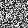
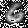
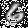
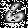
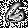
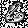
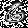

The semantic extraction part of the proposed method in "Deep Learning-Enabled Semantic Communication Systems with Task-Unaware Transmitter and Dynamic Data".

## Notes
The folder is for image classification task with the MNIST and CIFAR10 datasets. The image segmentation task with the PASCAL-VOC dataset is in the sub-folder [VOC](./VOC).

## Quick Start
### Train the Classifier (Pragmatic Function)

#### 1) For the MNIST dataset
```bash
$ python MLP_MNIST_model.py 
```

#### 2) For the CIFAR10 dataset
```bash
$ python googlenet_train.py 
```

### Train the Semantic Extraction Part
#### 1) For the MNIST dataset
```bash
$ python MNIST.py --alpha xx --pretrain_epoch xx --random_seed xx
```

#### 2) For the CIFAR10 dataset
```bash
$ python CIFAR.py --alpha xx --pretrain_epoch xx --random_seed xx
```

## Some Results

:   

:   

:   

:   

:   

:   

:   

:   

:   

:   


## Citation

Please use the following BibTeX citation if you use this repository in your work:

```
@article{Deep_semantic_comm_2022,
  title={Deep Learning-Enabled Semantic Communication Systems with Task-Unaware Transmitter and Dynamic Data},
  author={Zhang, Hongwei and Shao, Shuo and Tao, Meixia and Bi, Xiaoyan and Letaief, Khaled B},
  journal={arXiv preprint arXiv:2205.00271},
  year={2022}
}
```

