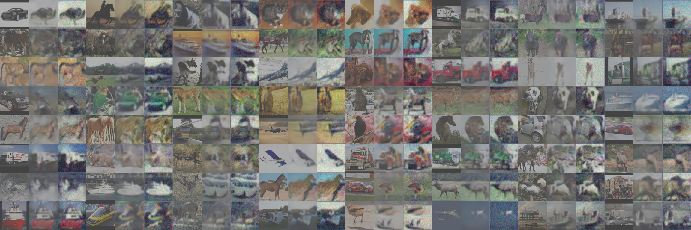

The data adaptation part of the proposed method in "Deep Learning-Enabled Semantic Communication Systems with Task-Unaware Transmitter and Dynamic Data".

The folder is for image classification, DA is for from the SVHN dataset to the MNIST dataset, from the USPS dataset to the MNIST dataset and from the STL10 dataset to the CIFAR10 dataset.

#### Download the dataset
```bash
$ chmod +x download.sh
$ ./download.sh
```


## Quick Start
### Train the CIFAR10 classifier
```bash
$ python googlenet_train.py
```

### The Scheme with DA
The proposed method.
#### 1) SVHN to MNIST
```bash
$ python main_svhn_mnist.py --use_labels=True --use_reconst_loss=False
```

#### 2) USPS to MNIST
```bash
$ python main_usps_mnist.py --use_labels=True --use_reconst_loss=False
```

#### 3) STL10 to CIFAR10
```bash
$ python main_stl_cifar.py --use_labels=True --use_reconst_loss=False
```

### The Scheme without DA
One benchmark, where the newly observed data is directly transmitted without retraining the coders.
#### 1) SVHN
```bash
$ python main_only_svhn.py --use_labels=True --use_reconst_loss=False
```

#### 2) USPS
```bash
$ python main_only_usps.py --use_labels=True --use_reconst_loss=False
```

#### 3) STL10
```bash
$ python main_only_stl.py --use_labels=True --use_reconst_loss=False
```

### The Retraining Scheme
Another benchmark, where the coders are retrained according to the newly observed data.
#### 1) SVHN
```bash
$ python SVHN_coder.py
```

#### 2) USPS
```bash
$ python USPS_coder.py
```

#### 3) STL10
```bash
$ python STL10_coder.py
```

## Results
There are three columns in one group. The first column is the raw image, the second column is the image after DA, and the third column is the recovered data.

SVHN to MNIST

  

USPS to MNIST

  

STL10 to CIFAR10

  


## Acknowledgement
This part is based on [MNIST-to-SVHN and SVHN-to-MNIST](https://github.com/yunjey/mnist-svhn-transfer).

## Reference

[1] [Unpaired Image-to-Image Translation using Cycle-Consistent Adversarial Networks](https://arxiv.org/pdf/1703.10593.pdf)

[2] [Semi-Supervised Learning with Generative Adversarial Networks](https://arxiv.org/abs/1606.01583)


## Citation

Please use the following BibTeX citation if you use this repository in your work:

```
@ARTICLE{9953099,
  author={Zhang, Hongwei and Shao, Shuo and Tao, Meixia and Bi, Xiaoyan and Letaief, Khaled B.},
  journal={IEEE Journal on Selected Areas in Communications}, 
  title={Deep Learning-Enabled Semantic Communication Systems With Task-Unaware Transmitter and Dynamic Data}, 
  year={2023},
  volume={41},
  number={1},
  pages={170-185},
  doi={10.1109/JSAC.2022.3221991}}
```


